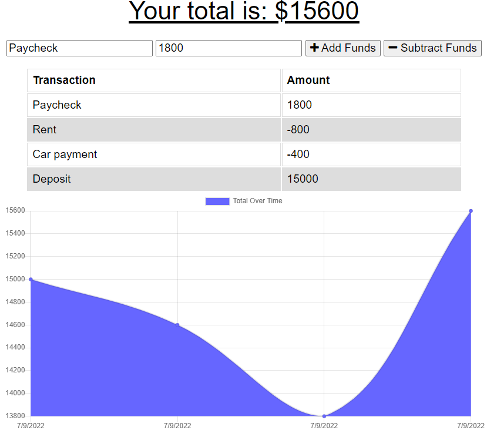

 #  My Budget Tracker

  
  
  
  ## Description
  To update an existing budget tracker application to allow for offline access and functionality. The user will be able to add expenses and deposits to their budget with or without a connection. If the user enters transactions offline, the total should be updated when they're brought back online. 

  ### Tools and Languages used
  ##### Frontend:

##### Backend:

##### Tools:

  
##### Database:  
 

#### Dependencies:

  ## Screenshots
  

  
  ## Links
  GitHub Repository: https://github.com/wizzle13/my-budget-tracker

  Heroku URL: https://my-budget-tracker-cb.herokuapp.com/

  &copy;2020 by Chris Burton
